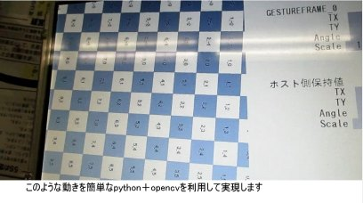
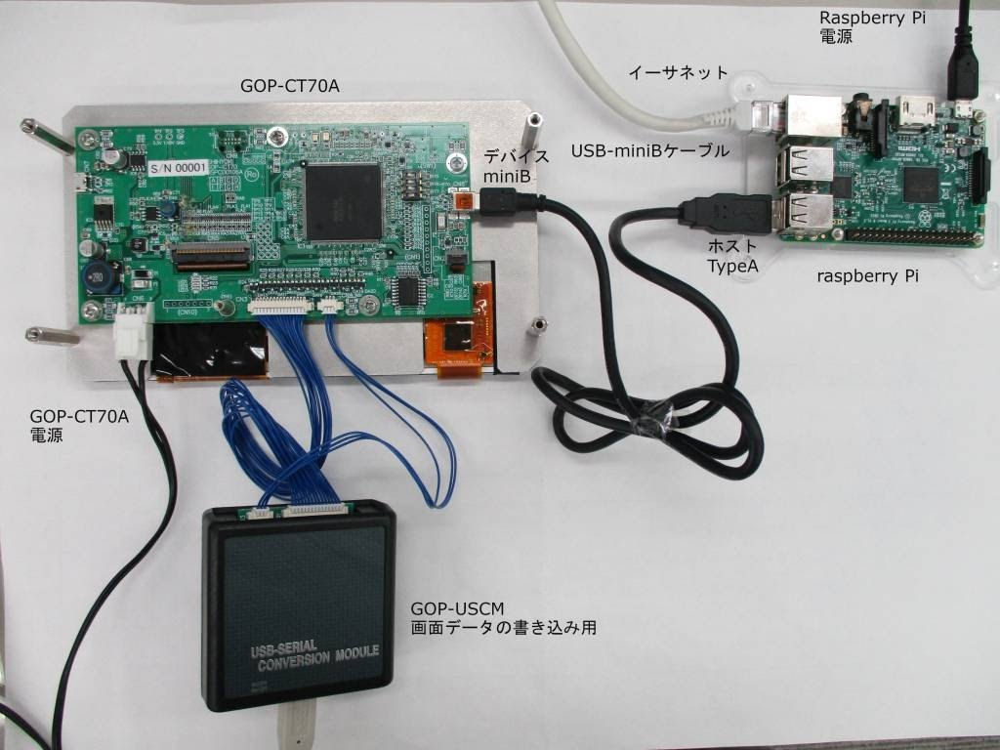
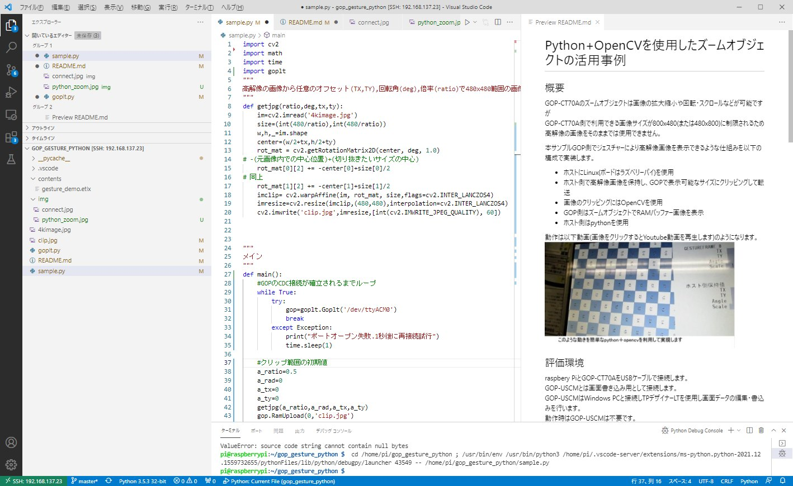
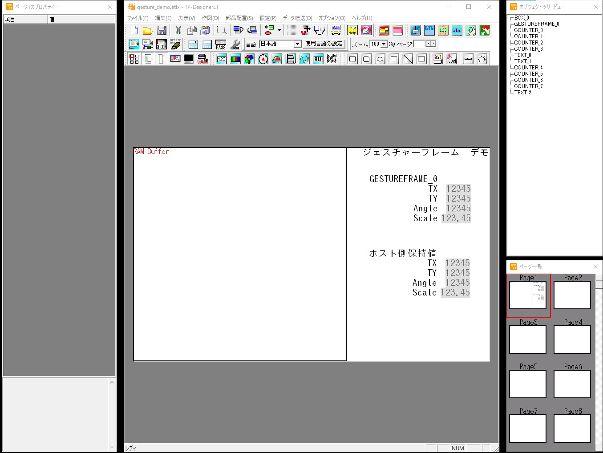

# Python+OpenCVを使用したズームオブジェクトの活用事例
## 概要
GOP-CT70Aのズームオブジェクトは画像の拡大縮小や回転・スクロールなどが可能ですが  
GOP-CT70A側で利用できる画像サイズが800x480(または480x800)に制限されるため  
高解像の画像をそのままでは使用できません。  

本サンプルGOP側でジェスチャーにより高解像画像を表示できるような仕組みを以下の構成で実装します。    
* ホストにLinux(ボードはラズベリーパイ)を使用  
* ホスト側で高解像画像を保持し、GOPで表示可能なサイズにクリッピングして転送  
* 画像のクリッピングにはOpenCVを使用  
* GOP側はズームオブジェクトでRAMバッファー画像を表示  
* ホスト側はpythonを使用  

動作は以下動画(画像をクリックするとYoutube動画を再生します)のようになります。  
[](https://www.youtube.com/watch?v=LMtFu8198e8&ab_channel=GOPChannel)  
## 評価環境  
raspbery PiとGOP-CT70AをUSBケーブルで接続します。  
GOP-USCMとは画面書き込み用として接続します。  
GOP-USCMはWindows PCと接続しTPデザイナーLTを使用し画面データの編集・書込みを行います。  
動作時はGOP-USCMは不要です。  



raspbery Piのコード編集はVSCodeを使用しSSH接続にてリモートで行っています。  

vscodeを利用してのraspbery Pi開発については [web上に記事](https://www.google.com/search?q=vscode%E3%82%92%E5%88%A9%E7%94%A8%E3%81%97%E3%81%A6%E3%81%AEraspberry+Pi%E9%96%8B%E7%99%BA&rlz=1C1GCEU_jaJP821JP822&sxsrf=APq-WBuTo9K2HTGxFy_9DBxFAhtOaYvwTQ%3A1643343464375&ei=aG7zYbWSFuCFr7wP1O6z8Ao&ved=0ahUKEwi15r-7y9P1AhXgwosBHVT3DK4Q4dUDCA4&oq=vscode%E3%82%92%E5%88%A9%E7%94%A8%E3%81%97%E3%81%A6%E3%81%AEraspbery+Pi%E9%96%8B%E7%99%BA&gs_lcp=Cgdnd3Mtd2l6EAxKBAhBGABKBAhGGABQAFgAYABoAHABeACAAQCIAQCSAQCYAQA&sclient=gws-wiz
)は多くありますのでそれらを参照してください。  
mata
pythonはopencv-pythonとpyserialモジュールが必要です。  
これらも記事がありますので([opnecv](https://www.google.com/search?q=%E3%83%A9%E3%82%BA%E3%83%91%E3%82%A4+opencv+%E3%82%A4%E3%83%B3%E3%82%B9%E3%83%88%E3%83%BC%E3%83%AB&sxsrf=APq-WBsH2Gnpibidv0U68cJcGlFOblOx_A%3A1643343734813&ei=dm_zYeGXMcOJhwPdha2QDA&ved=0ahUKEwjhqrq8zNP1AhXDxGEKHd1CC8IQ4dUDCA4&uact=5&oq=%E3%83%A9%E3%82%BA%E3%83%91%E3%82%A4+opencv+%E3%82%A4%E3%83%B3%E3%82%B9%E3%83%88%E3%83%BC%E3%83%AB&gs_lcp=Cgdnd3Mtd2l6EAMyBQgAEIAEMgUIABCABDIFCAAQgAQyBQgAEIAEMgUIABCABDIGCAAQBxAeMgYIABAHEB4yBggAEAcQHjoHCCMQsAMQJzoHCAAQRxCwAzoECAAQDUoECEEYAEoECEYYAFC2G1iGJmDqLmgCcAJ4AIABsAGIAe0EkgEDNS4xmAEAoAEByAEKwAEB&sclient=gws-wiz),[pyserial](https://www.google.com/search?q=%E3%83%A9%E3%82%BA%E3%83%91%E3%82%A4+pyserial+%E3%82%A4%E3%83%B3%E3%82%B9%E3%83%88%E3%83%BC%E3%83%AB&sxsrf=APq-WBtdqOmHCtKQdPKs3a89wVKx8SIbOw%3A1643343727597&ei=b2_zYYf-I5X7hwPmnLbgBg&oq=razupai+pyserial+%E3%82%A4%E3%83%B3%E3%82%B9%E3%83%88%E3%83%BC%E3%83%AB&gs_lcp=Cgdnd3Mtd2l6EAMYADIHCAAQgAQQBDoHCAAQRxCwAzoHCCMQsAIQJzoECAAQDToGCAAQDRAeOggIABAHEAQQHjoGCAAQBxAeSgQIQRgASgQIRhgAUK0HWMgSYMAcaAFwAngAgAFwiAGsBpIBAzQuNJgBAKABAcgBCsABAQ&sclient=gws-wiz))これらを参照してください。  
## 構成
* sample.py  
本サンプルのメインファイルです。  
    * 関数 ```getjpg(ratio,deg,tx,ty)```  
    ベース画像を指定の倍率角度オフセットで切り取ります
    * 関数 ```main()```  
    メイン関数です。  
    GOPとの通信確立後、ソース画像を初期条件でクリップしGOPに転送します。
    その後、GOP側のズームオブジェクト操作完了時に出力される'TOUCH_UP'のメッセージを受信の都度以下をを行います  
        * 角度・オフセット･倍率の読み出し  
        * その条件で画像の再クリップ
        * 画像転送  
        * ズームオブジェクトの初期値再設定  

* goplt.py
GOP-LT/CTシリーズとのコマンド通信処理ライブラリです。  
    * 使い方  
```python
import goplt
gop=goplt.Goplt('/dev/ttyACM0') #使用するポート指定してインスタンス生成

gop.WriteMem('LAYER1',1)        #GOPのメモリーへの書き込み LAYER1に1を書き込み
gop.WriteMem('MEM1',1,2,3)      #複数書き込み値を指定するとMEM1を先頭とするメモリーに連続書き込み

mem1,mem2,mem3=gop.ReadMem('MEM1',3) #MEM1から連続する3つのメモリーを読み込み
gop.RamUpload(0,'clip.jpg')         #指定のファイルをRAMバッファー　ブロック0に転送
```
* 4kimage.jpg  
    高解像のベース画像です  
    
* clip.jpg  
    本サンプル実行により生成されるクリップされた画像です  
* contents/gesture_demo.etlx  
    このファイルをwindows PCにダウンロードしTPデザイナーLTで開きます。  
    


## コード
```python
import cv2
import math
import time
import goplt
"""
高解像の画像から任意のオフセット(TX,TY),回転角(deg),倍率(ratio)で480x480範囲の画像を切り出しclip.jpgで保存
"""
def getjpg(ratio,deg,tx,ty):
    im=cv2.imread('4kimage.jpg')
    size=(int(480/ratio),int(480/ratio))
    w,h,_=im.shape
    center=(w/2+tx,h/2+ty)
    rot_mat = cv2.getRotationMatrix2D(center, deg, 1.0)
# -(元画像内での中心位置)+(切り抜きたいサイズの中心)
    rot_mat[0][2] += -center[0]+size[0]/2
# 同上 
    rot_mat[1][2] += -center[1]+size[1]/2
    imclip= cv2.warpAffine(im, rot_mat, size,flags=cv2.INTER_LANCZOS4)
    imresize=cv2.resize(imclip,(480,480),interpolation=cv2.INTER_LANCZOS4)
    cv2.imwrite('clip.jpg',imresize,[int(cv2.IMWRITE_JPEG_QUALITY), 60])


"""
メイン
"""
def main():
    #GOPのCDC接続が確立されるまでループ
    while True:
        try:
            gop=goplt.Goplt('/dev/ttyACM0')
            break
        except Exception:
            print("ポートオープン失敗.1秒後に再接続試行")
            time.sleep(1)

    #クリップ範囲の初期値
    a_ratio=0.5
    a_rad=0
    a_tx=0
    a_ty=0
    getjpg(a_ratio,a_rad,a_tx,a_ty)
    gop.RamUpload(0,'clip.jpg')
    tx=0
    ty=0
    angle_deg=0
    scale=100
    block=0
    try:
        gop.WriteMem('GESTUREFRAME_0.TX',tx,ty,angle_deg,scale,block,0)
        while True:
            s=gop.Enq()
            if(s!=''):
                if(s==b'TOUCH_UP'):
                    tx,ty,angle_deg,scale,block=gop.ReadMem('GESTUREFRAME_0.TX',5) 
                    old_ratio=a_ratio
                    old_rad=a_rad
                    a_ratio=a_ratio*scale/100.0
                    a_rad=(a_rad+angle_deg)%360
                    dx=math.cos(math.radians(old_rad))*tx-math.sin(math.radians(old_rad))*ty
                    dy=math.sin(math.radians(old_rad))*tx+math.cos(math.radians(old_rad))*ty

                    a_tx=a_tx-(dx/old_ratio)
                    a_ty=a_ty-(dy/old_ratio)
                    getjpg(a_ratio,a_rad,a_tx,a_ty)

                    block=8000 if block==0 else 0

                    gop.RamUpload(block,'clip.jpg')

                    gop.WriteMem('TOUCH_ANGLE',0)
                    gop.WriteMem('GESTUREFRAME_0.TX',0,0,0,100,block,0)
                    gop.WriteMem('G_0TX',a_tx,a_ty,a_rad,a_ratio*100)
    except ValueError as e:
        print(e)
               
main()

```

## 実行
```sh
pi@raspberrypi:~/gop_gesture_python $ python3 sample.py 
```

## その他
本サンプルのwindows上での実行ですが、GOP-CTとのUSB-CDC接続とpyserialの相性問題のせいか  
USBケーブルでの接続では動作しません。  
サンプルを試す場合GOP-USCM経由でホストポート接続となるCOMポートでご確認ください。  
なおGOP-USCM経由の場合通信速度は上限115200bpsとなるため画像転送に時間がかかります。  
